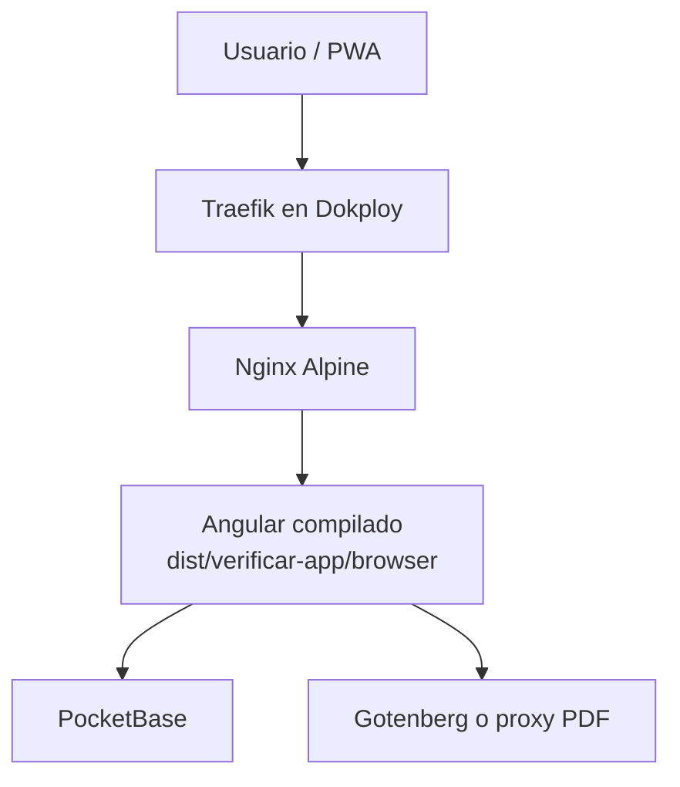
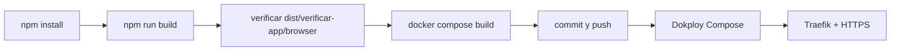

# VerificarIT

PWA Angular para gestionar inspecciones vehiculares, evidencias, vencimientos documentales y reportes PDF.

## Indice

- [Descripcion](#descripcion)
- [Arquitectura](#arquitectura)
- [Tecnologias](#tecnologias)
- [Requisitos](#requisitos)
- [Instalacion](#instalacion)
- [Compilacion](#compilacion)
- [Despliegue](#despliegue)
- [Dokploy](#dokploy)
- [Docker](#docker)
- [PWA](#pwa)
- [Estructura](#estructura)
- [Scripts](#scripts)
- [Troubleshooting](#troubleshooting)
- [Documentacion](#documentacion)
- [Contribucion](#contribucion)
- [Licencia](#licencia)

## Descripcion

VerificarIT es un frontend Angular/PWA para operacion de inspecciones vehiculares. La aplicacion permite iniciar sesion, crear inspecciones nuevas o heredadas, consultar historial por placa, administrar evidencias, registrar firmas, controlar vencimientos y generar certificados PDF desde una plantilla Excel.

El repositorio no contiene backend Node. La aplicacion compilada se sirve como SPA estatica dentro de Nginx y consume servicios externos definidos por configuracion runtime:

- PocketBase para autenticacion, datos, archivos y realtime.
- Gotenberg, o un proxy PDF compatible, para convertir XLSX/HTML a PDF.
- `public/config/app-config.js` para endpoints publicos de runtime.

## Arquitectura



El contenedor de produccion no compila Angular. `Dockerfile` copia el contenido ya generado en `dist/verificar-app/browser` hacia `/usr/share/nginx/html` y arranca `nginx:alpine`.

La configuracion de Nginx hace tres cosas criticas:

- Sirve archivos estaticos del build Angular.
- Redirige rutas SPA a `index.html` mediante `try_files`.
- Ajusta cache para `index.html`, `manifest.json`, `ngsw.json` y workers PWA.

Mas detalle: [docs/architecture.md](docs/architecture.md).

## Tecnologias

- Angular 21 con standalone components.
- TypeScript 5.9.
- Angular Service Worker y `ngsw-config.json`.
- PocketBase SDK.
- ExcelJS, `xlsx` y `file-saver` para reportes.
- Gotenberg para conversion PDF.
- Docker Compose.
- Nginx Alpine.
- Dokploy Compose con Traefik gestionado por Dokploy.
- VitePress para documentacion tecnica.

## Requisitos

- Node.js `>=20.19` o `>=22.12`.
- npm `>=10`.
- Docker con Compose v2 para pruebas locales de imagen.
- Acceso a PocketBase por HTTPS.
- Acceso a Gotenberg o proxy PDF por HTTPS.
- Proyecto Dokploy con repositorio GitHub conectado para despliegue.

## Instalacion

```bash
npm install
```

> El flujo solicitado para este proyecto usa `npm install`. Si se necesita una instalacion reproducible en CI, validar primero el `package-lock.json` y usar `npm ci`.

## Configuracion

La aplicacion lee configuracion publica desde `public/config/app-config.js` y usa `src/environments/*` como fallback.

```js
window.__APP_CONFIG__ = {
  pocketbaseUrl: '',
  gotenbergBaseUrl: 'https://gotenberg.buckapi.online/',
  imagesCollectionId: '5bjt6wpqfj0rnsl'
};
```

No poner secretos en Angular, `public/`, variables de build frontend ni archivos servidos por Nginx. Todo lo que llega al navegador debe considerarse publico.

## Compilacion

```bash
npm run build
```

Verificar que exista la salida usada por Docker:

```bash
ls dist/verificar-app/browser
```

Archivos esperados despues del build actual:

- `index.html`
- `manifest.json`
- `ngsw.json`
- `ngsw-worker.js`
- `safety-worker.js`
- bundles JavaScript y CSS con hash
- assets copiados desde `public/`

## Despliegue

Flujo completo:



Pasos locales:

```bash
npm install
npm run build
ls dist/verificar-app/browser
docker compose config
docker compose build
docker compose up -d
docker compose logs
```

Cuando el contenedor local este validado:

```bash
git status
git add README.md docs
git commit -m "docs: update dokploy deployment guide"
git push
```

No se debe ejecutar `docker compose build` antes de `npm run build`, porque `.dockerignore` excluye `src`, `public`, `package.json`, `package-lock.json` y `angular.json`. La imagen solo recibe `dist/verificar-app/browser`, `Dockerfile`, `docker-compose.yml` y `nginx.conf`.

Guia completa: [docs/deployment.md](docs/deployment.md).

## Dokploy

En Dokploy:

1. Crear un servicio Compose.
2. Seleccionar GitHub como fuente.
3. Seleccionar el repositorio y la rama.
4. Seleccionar `docker-compose.yml`.
5. Ejecutar deploy.
6. Configurar dominio.
7. Usar puerto interno `80`.
8. Activar HTTPS.
9. Dejar que Traefik enrute el dominio hacia el servicio.
10. Ejecutar redeploy cuando haya nuevos commits.

Dokploy administra Traefik fuera de este repositorio. Por eso `docker-compose.yml` no contiene labels de Traefik ni certificados. El compose solo define el servicio `web`, la construccion local de imagen y el puerto interno expuesto.

Mas detalle: [docs/dokploy.md](docs/dokploy.md).

## Docker

Archivos reales del despliegue:

- `Dockerfile`
- `docker-compose.yml`
- `nginx.conf`
- `.dockerignore`

Resumen del contenedor:

```dockerfile
FROM nginx:alpine
COPY dist/verificar-app/browser/ /usr/share/nginx/html/
COPY nginx.conf /etc/nginx/conf.d/default.conf
EXPOSE 80
```

Mas detalle: [docs/docker.md](docs/docker.md).

## PWA

La PWA esta habilitada en produccion con:

- `@angular/service-worker`.
- `provideServiceWorker('ngsw-worker.js')`.
- `serviceWorker: "ngsw-config.json"` en `angular.json`.
- `public/manifest.json`.
- Iconos y screenshots bajo `public/assets`.
- Reglas de cache en `ngsw-config.json`.
- Reglas de cache HTTP en `nginx.conf` para `manifest.json`, `ngsw.json` y workers.

Mas detalle: [docs/pwa.md](docs/pwa.md).

## Estructura

```text
.
├── Dockerfile
├── docker-compose.yml
├── nginx.conf
├── .dockerignore
├── angular.json
├── ngsw-config.json
├── package.json
├── public/
│   ├── config/app-config.js
│   ├── manifest.json
│   └── assets/
├── src/
│   └── app/
├── dist/verificar-app/browser/
└── docs/
```

## Scripts

```bash
npm start
npm run build
npm run watch
npm test
npm run docs:dev
npm run docs:build
npm run docs:preview
```

El servidor de desarrollo Angular se abre en `http://localhost:4200`.

## Troubleshooting

Errores frecuentes:

- `COPY dist/verificar-app/browser/ failed`: falta ejecutar `npm run build`.
- Rutas como `/home` devuelven 404: revisar `nginx.conf` y `try_files $uri $uri/ /index.html`.
- PWA no actualiza: verificar que `ngsw.json` y `ngsw-worker.js` no queden cacheados.
- Dominio sin HTTPS en Dokploy: revisar DNS, dominio asignado, puerto interno `80` y estado de Traefik.
- PDF falla: validar `gotenbergBaseUrl` o proxy PDF en `public/config/app-config.js`.

Guia completa: [docs/troubleshooting.md](docs/troubleshooting.md).

## Documentacion

Documentos principales:

- [Arquitectura](docs/architecture.md)
- [Despliegue](docs/deployment.md)
- [Dokploy](docs/dokploy.md)
- [Docker](docs/docker.md)
- [PWA](docs/pwa.md)
- [Movil](docs/mobile.md)
- [Troubleshooting](docs/troubleshooting.md)

La documentacion VitePress existente tambien vive en `docs/`:

```bash
npm run docs:dev
npm run docs:build
npm run docs:preview
```

## Contribucion

Antes de abrir cambios:

1. Mantener el alcance del cambio separado entre codigo y documentacion.
2. Ejecutar `npm run build` si se modifica Angular, PWA o assets.
3. Ejecutar `docker compose config` si se modifica Docker o Compose.
4. Actualizar `docs/` y este README cuando cambie el despliegue.

## Licencia

El repositorio no declara una licencia explicita en el estado actual. Agregar un archivo `LICENSE` antes de publicar o distribuir el proyecto como open source.
