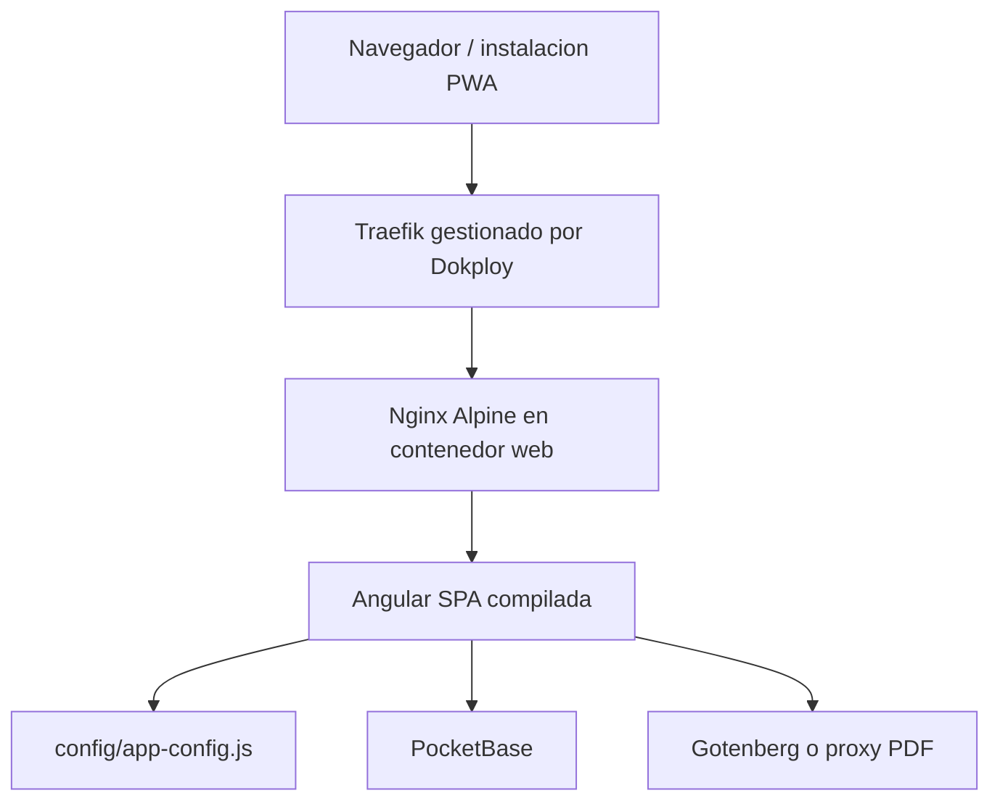

# Arquitectura

## Indice

- [Resumen](#resumen)
- [Diagrama](#diagrama)
- [Capas](#capas)
- [Runtime](#runtime)
- [Rutas](#rutas)
- [Servicios Angular](#servicios-angular)
- [Persistencia externa](#persistencia-externa)

## Resumen

VerificarIT es una SPA Angular compilada y servida por Nginx. El repositorio no ejecuta un backend propio en produccion. La persistencia, autenticacion, realtime y archivos dependen de PocketBase. La generacion PDF usa Gotenberg o un proxy compatible.

La imagen Docker actual contiene solo artefactos compilados:

```text
dist/verificar-app/browser
```

## Diagrama



## Capas

- `src/app/pages`: pantallas de login, home, nueva inspeccion, inspeccion heredada, listado y detalle.
- `src/app/components`: header, sidebar y footer.
- `src/app/services`: integracion con PocketBase, realtime, PDF, Excel y PWA.
- `public/`: assets servidos como archivos estaticos.
- `dist/verificar-app/browser`: salida real que Nginx publica.

## Runtime

`src/index.html` carga:

```html
<script src="config/app-config.js"></script>
```

`src/app/config/app-config.ts` lee `window.__APP_CONFIG__` y usa `src/environments/*` como fallback.

Valores actuales en `public/config/app-config.js`:

```js
window.__APP_CONFIG__ = {
  pocketbaseUrl: '',
  gotenbergBaseUrl: 'https://gotenberg.appverificar.online/',
  imagesCollectionId: '5bjt6wpqfj0rnsl'
};
```

## Rutas

- `/login`
- `/home`
- `/nueva`
- `/heredada`
- `/inspections`
- `/detail/:id`

Nginx usa `try_files $uri $uri/ /index.html` para que esas rutas funcionen al recargar el navegador.

## Servicios Angular

- `AuthService`: login, logout, usuario actual y recuperacion de contrasena.
- `InspectionService`: CRUD de inspecciones, imagenes, secuencias y URLs de archivos.
- `RealtimeInspectionsService`: realtime, cache local y carga progresiva.
- `ExcelExportService`: construccion de XLSX y flujo de PDF.
- `GotenbergService`: conversion PDF y descarga de blobs.
- `PwaInstallService`: prompt de instalacion PWA.

## Persistencia externa

PocketBase define las colecciones documentadas en `docs/pb_schema.json`:

- `users`
- `inspections`
- `images`
- `secuencias`
- `files`
- `firmas`

El contenedor Docker de este repositorio no incluye PocketBase ni Gotenberg. Ambos deben existir como servicios externos accesibles desde el navegador.
