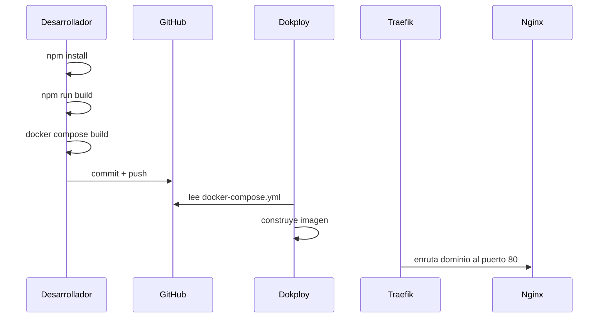

# Despliegue

## Indice

- [Modelo actual](#modelo-actual)
- [Paso a paso](#paso-a-paso)
- [Validacion local con Docker](#validacion-local-con-docker)
- [Publicacion](#publicacion)
- [Redeploy](#redeploy)
- [Actualizar la aplicacion](#actualizar-la-aplicacion)
- [Variables](#variables)

## Modelo actual

El despliegue actual usa Dokploy Compose sobre una imagen Nginx Alpine.

Punto clave: Docker no compila Angular. El build debe existir antes de construir la imagen:

```text
dist/verificar-app/browser
```

Esto coincide con `.dockerignore`, que excluye `src`, `public`, `package.json`, `package-lock.json`, `angular.json`, `ngsw-config.json` y `docs`. La imagen final solo necesita la salida compilada y la configuracion Nginx.

## Paso a paso

1. Instalar dependencias.

```bash
npm install
```

2. Compilar Angular.

```bash
npm run build
```

3. Verificar salida.

```bash
ls dist/verificar-app/browser
```

4. Validar Compose local.

```bash
docker compose config
docker compose build
docker compose up -d
docker compose logs
```

5. Versionar cambios.

```bash
git status
git add README.md docs
git commit -m "docs: update dokploy deployment guide"
git push
```

6. Desplegar en Dokploy.

- Crear servicio Compose.
- Seleccionar GitHub.
- Seleccionar repositorio.
- Seleccionar rama.
- Seleccionar `docker-compose.yml`.
- Ejecutar deploy.
- Configurar dominio.
- Usar puerto interno `80`.
- Activar HTTPS.
- Confirmar que Traefik enruta al servicio.
- Ejecutar redeploy si hay cambios posteriores.

## Validacion local con Docker

`docker-compose.yml` define un servicio:

```yaml
services:
  web:
    build:
      context: .
      dockerfile: Dockerfile
    restart: unless-stopped
    expose:
      - "80"
    networks:
      - web
```

`expose: "80"` publica el puerto dentro de la red Docker, no en el host. En Dokploy esto es suficiente porque Traefik se conecta al puerto interno configurado en la UI.

Para probar desde el host local puede ser necesario agregar temporalmente un mapeo `ports`, pero ese cambio no forma parte del compose actual del repositorio.

## Publicacion



## Redeploy

Usar redeploy cuando:

- Se hizo push de nuevos commits.
- Se recompilo `dist/verificar-app/browser`.
- Se cambio `Dockerfile`, `docker-compose.yml` o `nginx.conf`.
- Se cambio configuracion de dominio en Dokploy.

Flujo recomendado:

```bash
npm run build
docker compose build
git status
git add .
git commit -m "chore: update production build"
git push
```

Luego ejecutar redeploy desde Dokploy.

## Actualizar la aplicacion

Para una version futura:

1. Cambiar codigo o assets.
2. Ejecutar `npm install` si cambiaron dependencias.
3. Ejecutar `npm run build`.
4. Verificar `dist/verificar-app/browser`.
5. Ejecutar `docker compose config`.
6. Ejecutar `docker compose build`.
7. Hacer commit del cambio requerido.
8. Hacer push.
9. Ejecutar redeploy en Dokploy.
10. Validar dominio, login, rutas SPA, PWA y PDF.

## Variables

El compose actual no define variables de entorno. La configuracion publica de la app esta en:

```text
public/config/app-config.js
```

Como Docker copia `dist/verificar-app/browser`, cualquier cambio en `public/config/app-config.js` requiere:

```bash
npm run build
docker compose build
git add dist/verificar-app/browser
git commit -m "chore: update runtime config"
git push
```

No colocar secretos en ese archivo.
