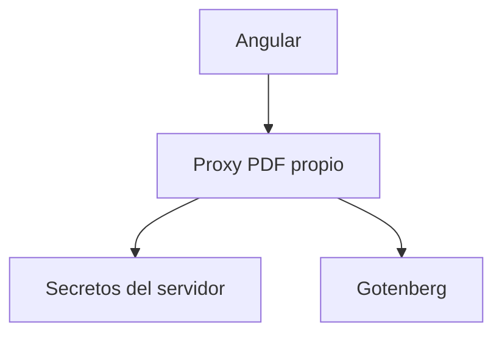

# Seguridad de Gotenberg

## Contexto

La aplicacion Angular corre en el navegador. Cualquier valor incluido en estos lugares puede quedar visible para el usuario:

- `src/environments/*`
- `public/config/app-config.js`
- bundle Angular compilado
- archivos dentro de `dist/verificar-app/browser`

Por eso las credenciales de Gotenberg no deben vivir en este frontend.

## Estado actual

`public/config/app-config.js` define una URL publica:

```js
window.__APP_CONFIG__ = {
  pocketbaseUrl: '',
  gotenbergBaseUrl: 'https://gotenberg.appverificar.online',
  // gotenbergBaseUrl: 'https://gotenberg.appverificar.online/',

  imagesCollectionId: '5bjt6wpqfj0rnsl'
};
```

Ese archivo es publico porque Nginx lo sirve al navegador.

## Que puede ir en Angular

- URL publica de PocketBase.
- URL publica de Gotenberg o de un proxy PDF.
- ID de coleccion de imagenes.
- Parametros no sensibles de interfaz.

## Que no puede ir en Angular

- Usuario de Gotenberg.
- Contrasena de Gotenberg.
- Tokens.
- Headers `Authorization`.
- Cualquier secreto de infraestructura.

## Arquitectura recomendada si hay autenticacion



Angular debe llamar al proxy. El proxy agrega credenciales desde un entorno servidor y reenvia el PDF al navegador.

## Checklist

- No guardar credenciales en `public/config/app-config.js`.
- No generar secretos dentro de `dist/verificar-app/browser`.
- Restringir CORS al dominio de la app.
- Usar HTTPS para frontend, PocketBase y PDF.
- Rotar cualquier credencial que haya sido expuesta en archivos publicos.
