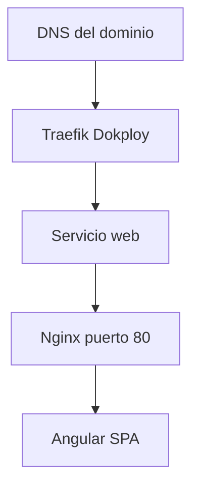

# Dokploy

## Indice

- [Como encaja Dokploy](#como-encaja-dokploy)
- [Crear servicio Compose](#crear-servicio-compose)
- [Dominio y HTTPS](#dominio-y-https)
- [Traefik](#traefik)
- [Cambiar dominio](#cambiar-dominio)
- [Agregar dominios](#agregar-dominios)
- [Renovar certificados](#renovar-certificados)
- [Redeploy](#redeploy)

## Como encaja Dokploy

Dokploy toma el `docker-compose.yml` del repositorio, construye el servicio `web` y lo conecta con su proxy Traefik. En este repositorio no hay labels de Traefik ni certificados porque esas piezas se configuran desde la UI de Dokploy.

## Crear servicio Compose

1. Abrir Dokploy.
2. Crear un servicio Compose.
3. Seleccionar GitHub.
4. Seleccionar este repositorio.
5. Seleccionar la rama de despliegue.
6. Seleccionar `docker-compose.yml`.
7. Ejecutar deploy.

El puerto interno del servicio es:

```text
80
```

Ese puerto viene de `Dockerfile` (`EXPOSE 80`) y de `docker-compose.yml` (`expose: "80"`).

## Dominio y HTTPS

En la configuracion de dominio del servicio:

- Dominio: el FQDN publico de la aplicacion.
- Puerto interno: `80`.
- HTTPS: activado.
- Proxy: Traefik de Dokploy.

El contenedor no escucha HTTPS. HTTPS termina en Traefik y Traefik reenvia HTTP al contenedor Nginx.

## Traefik



Responsabilidades de Traefik:

- Recibir trafico publico del dominio.
- Terminar TLS/HTTPS.
- Renovar certificados cuando la configuracion de Dokploy y DNS lo permiten.
- Enrutar hacia el puerto interno `80`.

Responsabilidades de Nginx:

- Servir `dist/verificar-app/browser`.
- Resolver rutas SPA hacia `index.html`.
- Definir cache HTTP compatible con PWA.

## Cambiar dominio

1. Crear o actualizar el registro DNS del nuevo dominio hacia el servidor Dokploy.
2. Abrir el servicio Compose en Dokploy.
3. Reemplazar el dominio anterior por el nuevo.
4. Mantener puerto interno `80`.
5. Activar HTTPS.
6. Guardar y ejecutar redeploy si Dokploy lo solicita.
7. Validar `https://nuevo-dominio`.

No es necesario modificar `Dockerfile`, `docker-compose.yml` ni `nginx.conf` para cambiar el dominio.

## Agregar dominios

1. Agregar cada dominio en DNS.
2. Agregar cada dominio en la UI de Dokploy para el mismo servicio.
3. Usar puerto interno `80`.
4. Activar HTTPS para cada dominio.
5. Validar que todos resuelvan a la misma app.

Si la aplicacion debe comportarse distinto por dominio, ese comportamiento no existe en el codigo actual y debe implementarse antes de documentarlo como soportado.

## Renovar certificados

La renovacion depende de Traefik/Dokploy, no del contenedor Angular.

Si un certificado no renueva:

- Confirmar que el DNS apunta al servidor Dokploy.
- Confirmar que los puertos publicos 80 y 443 llegan al servidor.
- Confirmar que el dominio esta asociado al servicio correcto.
- Confirmar que el puerto interno configurado es `80`.
- Revisar logs/eventos de Dokploy y Traefik.

No copiar certificados dentro del repositorio.

## Redeploy

Ejecutar redeploy despues de:

- Push de una nueva version.
- Cambio en `dist/verificar-app/browser`.
- Cambio en Docker, Compose o Nginx.
- Cambio de dominio o HTTPS en Dokploy.

Dokploy reconstruye la imagen desde el repositorio. Por eso el build Angular compilado debe estar disponible en el estado del repositorio que Dokploy despliega.
